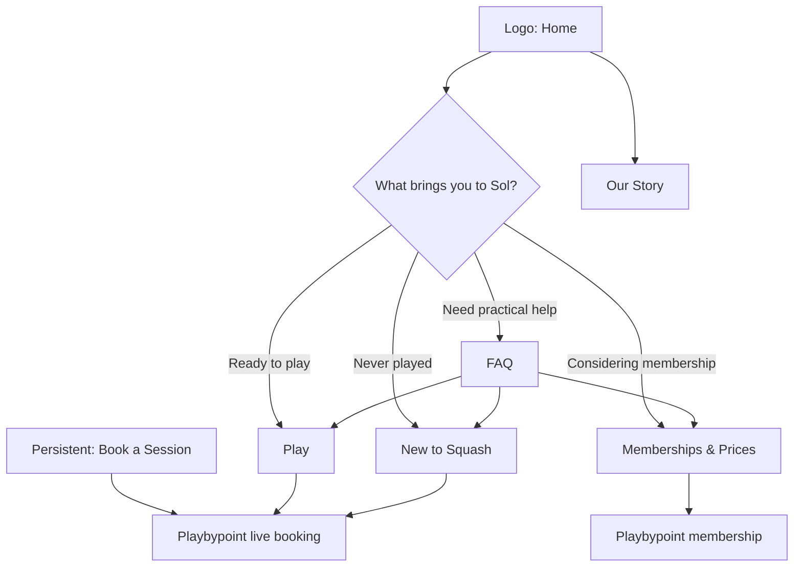

# Sol Squash UX, Booking, and Information-Architecture Blueprint

**Prepared for:** Sol Squash  
**Purpose:** Research-backed recommendation for a simpler public website and a clearer handoff into Playbypoint.  
**Scope:** This is an analysis and proposed blueprint only. It makes **no changes** to the current website. Every existing approved copy block and every current link destination remains an inventory item; dense material is reorganized or progressively disclosed rather than deleted.

> **Core decision:** Sol’s public website should make people confident about *which path is right for them*. Playbypoint should remain the system that manages live availability, accounts, waivers, reservation rules, payment, confirmation, and booking changes. The site must not imitate a live booking system or a checkout it does not operate.

## Executive Recommendation

Sol is not a generic gym, a conventional private club, or merely a court-rental business. It is a community-centered squash club that needs to accommodate three distinct visitor intentions without making any of them read a long explanation first:

| Visitor intent | The visitor is asking | The correct first destination | The next action |
|---|---|---|---|
| **First-time player** | “Can I do this, and what should I book?” | **New to Squash** | Choose First Lesson or Beginner Squash Clinic, then continue to booking. |
| **Returning or experienced player** | “What can I play, and when?” | **Play** | Choose court, open play, coached session, or private lesson; then continue to the appropriate live booking destination. |
| **Membership decision-maker** | “Is joining worth it?” | **Memberships & Prices** | Compare Sol Club, Sol Junior, packages, and visitor pricing; then continue to the membership destination. |
| **Practical-information seeker** | “What do I need to know?” | **FAQ** | Choose a clearly named topic, open one answer, then take the relevant next action. |

The strongest public racquet-club examples make first-timer onboarding, playing, membership, and booking distinct enough that visitors can self-select quickly. Wilson Padel Club Austin presents booking, clinics, and memberships as separate primary actions; Union Padel Club gives beginners a specifically coached entry route while giving ready players a fast booking route.[1] [2] This is especially relevant to Sol because it already offers a First Lesson, Beginner Squash Clinic, drop-in play, coaching, court time, session packs, and membership.

The alternative navigation currently moves in the right direction, but it still asks visitors to work too hard after selecting a page. The next version should tighten those **task paths**, not add more visual material.

## What Playbypoint Should Own—and What Sol Should Own

Playbypoint documents a member journey of facility home → Book Now → date and court type → slot → waiver when applicable → player review → checkout → confirmation.[3] It also gives the facility—not the marketing site—control of booking windows, guest rules, player requirements, pricing models, payment timing, cancellation rules, refund treatment, waitlists, and availability.[4]

| Layer | Sol public website should do | Playbypoint should do |
|---|---|---|
| **Discovery** | Explain the club, route visitors by goal, show the difference between court play, sessions, coaching, beginner options, and memberships. | Surface current bookable inventory once the visitor has chosen an activity. |
| **Decision support** | State the essential facts before a handoff: experience required, duration, *from* price, what is included, equipment expectation, and what happens next. | Apply the actual live price, eligibility, booking window, capacity, waitlist, waiver, and player requirements. |
| **Transaction** | Use a clear action such as **Continue to Booking** or **View Live Availability** that tells the visitor they are leaving Sol’s editorial experience. | Authenticate or create an account, collect waiver acceptance and payment, issue confirmation, and manage later changes. |
| **Policy** | Present short, plain policy summaries and link or route visitors to the full approved text. | Enforce cancellation, refund, guest, booking-limit, and payment rules configured by Sol. |
| **Live programme information** | Curate a short, truthful “what is on” discovery view only when it is current and directly linked. | Remain the authority for actual capacity, timing, waitlists, and registration. |

This division avoids two costly UX problems: **false affordance** (a control that looks transactional but is not) and **false freshness** (a schedule presented as live when it is static). It also respects the established constraint that Sol should not embed a Playbypoint iframe or create a competing grid calendar.

> Playbypoint’s own documentation makes the boundary clear: a visitor’s booking becomes a multi-step transaction involving schedule selection, possible waiver acceptance, player assignment, checkout, and confirmation.[3] The public website should set expectations for that handoff, not reproduce an incomplete version of it.

## Research Findings Applied to Sol

### 1. Prioritize three common tasks before club storytelling

Public racquet facilities need to serve both a new customer and a returning player. Comparable clubs explicitly foreground the actions “book,” “join a clinic,” and “membership,” while beginner-oriented pages answer equipment, confidence, and next-step questions before asking for a commitment.[1] [2] Sol’s First Lesson is not a secondary programme; it is an acquisition product and should be easy to reach from both Home and New to Squash.

**Design rule:** The Home page should put the three high-frequency intentions—**Play today**, **I am new**, and **Explore membership**—within one scroll of the first CTA. The club, recovery, founders, mural, and café story should then deepen affinity after a visitor knows where they fit.

### 2. Use progressive disclosure for policy, not for primary choices

Progressive disclosure works when a person first sees the few important options and can reveal specialized detail only when needed.[5] It is a poor substitute for a clear first choice. In practice, Sol should show options such as “First Lesson” and “Beginner Clinic” as visible decision cards, but defer detailed booking rules, membership notes, policies, coach credentials, and full FAQs to one secondary layer with an explicit label.

NN/g cautions against disclosure structures deeper than two secondary levels because people get lost.[5] For Sol this means: **page → topic/offer card → one expandable detail**, not page → tab → accordion → modal → external page.

### 3. Treat every CTA as a contractual promise

The current site contains arrows on static club-feature cards and includes a “Book a Session” control that opens a 5-pack offer dialog rather than starting booking. Those are false or ambiguous affordances. A card with an arrow must take the visitor somewhere, reveal a clearly named on-page section, or lose the arrow. A booking CTA must either open the real booking destination or state that it opens an informational step.

Clear task labels create stronger information scent than slogan-like labels.[6] Sol should use one of the following unambiguous actions consistently:

| Visitor goal | Recommended action label | Destination expectation |
|---|---|---|
| Court time | **Book a Court** | Takes the visitor to live court booking in Playbypoint. |
| Club programme | **See Live Sessions** | Takes the visitor to a truthful Sol session-discovery page or the Playbypoint programme listing. |
| Specific class | **Continue to Booking** | Takes the visitor to the relevant programme or to the generic booking destination if Sol has not provided a deep link. |
| Membership | **View Membership Options** | Takes the visitor to the live Playbypoint membership destination. |
| First-time help | **Start Here** | Takes the visitor to New to Squash. |
| Information only | **Learn About Recovery** or no arrow | Reveals a local section or removes the misleading cue. |

### 4. Make the payment handoff explicit and friction-light

Playbypoint supports payment and membership processing, while its facility settings determine timing and treatment. It can be configured around payment processors such as Stripe or CardConnect in the United States, but the appropriate payment interaction occurs inside Playbypoint—not in Sol’s static brochure site.[4] [7] A separate payment build in the Sol site would create a second source of truth and should not be introduced unless Sol deliberately adopts an integrated backend strategy.

Payment and checkout research consistently favors a linear flow, clear total/terms before commitment, one explicit primary action, no intrusive promotion during checkout, and a transparent off-site redirection cue.[8] The practical result is straightforward:

* Replace any faux booking dialog with a real handoff or a clearly named **See Packages** detail state.
* Do not make a visitor go through a static schedule merely to reach the generic booking site.
* Put the relevant price, duration, and eligibility beside the CTA; let Playbypoint show the live total, availability, waiver, and payment rules.
* If Sol configures direct Playbypoint deep links for court booking, First Lesson, Beginner Clinic, Open Play, private coaching, membership, and Sol Junior, use those links. Where a specific deep link is unavailable, be honest: **Open Live Booking**.

### 5. Build mobile around one decisive action at a time

The most common Sol visitor will likely arrive on a phone from search, social, WhatsApp, or a friend. On narrow screens, moving from curiosity to a booked session should never require guessing which of several near-identical buttons is correct. Touch targets should meet the W3C minimum of 24×24 CSS pixels or have adequate separation; larger areas are more forgiving in real-world touch use.[9]

On mobile, the header should use the branded logo as Home, a short vertically ordered menu, and a **persistent Book a Session** action. Do not place a second competing booking CTA in the same visual zone unless it has a clearly different job, such as **Start Here** for beginners.

## Current-State UX Audit

The following findings are based on review of the current alternative version’s live route structure and visible screens. They identify clarity and behavior issues, not aesthetic faults.

| Area | What works today | Friction or risk | Recommendation |
|---|---|---|---|
| **Primary navigation** | The current structure separates Play, New to Squash, Memberships & Prices, Our Story, FAQ, and Book a Session. | Home is duplicated by both a visible navigation item and the logo; six labels plus the CTA are crowded on desktop and visually small. | Use the logo as Home. Keep five text destinations: Play, New to Squash, Memberships & Prices, Our Story, FAQ. Preserve Book a Session as the distinct transaction action. |
| **Home hero** | Clear brand and one visible booking CTA. | A first-time visitor must infer that New to Squash is the right path from the header rather than receiving an immediate secondary route. | Place a quiet, clearly labeled beginner route beside or directly below the hero CTA. Keep the current copy; add only navigation context. |
| **Club feature cards** | The three cards give a quick view of courts, recovery, and social space. | The bottom-right arrows imply clicks although the cards do not lead anywhere. | Remove the arrows from static cards. Only make a full card interactive if it leads to a relevant route or an on-page destination. |
| **Play** | Ways to Play are understandable and the trial/membership path is visible. | The first open accordion dominates before the visitor chooses a task; each play type lacks a direct action; Taste of Sol appears before a visitor understands the options. | Put Ways to Play first, give each option its true booking action, then place Taste of Sol as a conversion bridge and membership as the final next step. |
| **New to Squash** | Strong confidence-building content, two clear offers, equipment reassurance, and real imagery. | Both offers route to the same generic schedule, adding a second decision step. | Use specific Playbypoint programme links when available. If not, retain the generic handoff but label it **Open Live Sessions** and explain that the visitor will choose a time there. |
| **Memberships & Prices** | The separate destination and price comparison support serious consideration. | It opens on a guest comparison and “Book a Session” is not the membership action. Packages, memberships, junior information, and price tables compete for attention. | Open on Sol Club membership value and its direct membership action. Place Sol Junior immediately after it, then session packages, then detailed all-prices comparison under an explicit “Compare every price” disclosure. |
| **Schedule / Upcoming Sessions** | The vertical list honors the mobile-first, no-iframe constraint and directs bookings to Playbypoint. | It uses static mock data but labels itself “Live Club Rhythm” and displays a dated programme card; this can become inaccurate. Each session also exits to a generic booking screen without carrying the selection. | Do not call the list live unless it has a reliable refresh process. Until current data/deep links exist, make the main Book CTA go directly to Playbypoint and position the list as a maintained editorial preview or secondary “What’s On” discovery page. |
| **FAQ** | Six approved categories and progressive accordions preserve detailed material without a wall of prose. | The category row is dense; no task shortcut, topic deep-link, search, or contextual onward path exists. Raw URLs appear as text in answers rather than useful links. | Start with high-frequency help choices; retain every category and answer under one clear topic layer; convert verbatim displayed URLs into actual links; link or route each topic to its corresponding action. |
| **Our Story** | It is a distinct brand page and retains its right-side story drawer. | It is not a high-frequency task, but currently takes as much header space as task pages. | Keep the page and drawer unchanged in behavior. Its placement after task-oriented destinations is appropriate. |

## Recommended Public Site Map

The proposed map is deliberately flatter than the current source structure. It keeps every current page or content group available, but reduces the number of decisions at the navigation level.

| Navigation element | Page purpose | Required existing material to retain | Primary action |
|---|---|---|---|
| **Logo / Home** | Quick orientation and club affinity. | Hero, club overview, recovery, founders invitation, mural visual, existing approved content. | Book a Session; Start Here for first-timers. |
| **Play** | Returning-player and active-player route. | Ways to Play, court/open-play/coached/private copy, Taste of Sol, membership prompt. | Specific live booking action for the selected activity. |
| **New to Squash** | Confidence and first action for people who have never played. | First Lesson, Beginner Clinic, racket/no-experience reassurance, approved beginner FAQs. | Continue to booking. |
| **Memberships & Prices** | Decision support before membership purchase. | Sol Club, Sol Junior, packages, adult and junior pricing, membership notes, all current price copy. | View Membership Options in Playbypoint. |
| **Our Story** | Emotional and credibility layer. | Existing story, journey, PSA/coaching credentials, founder and Frida profile cards, values, story drawer. | Read Our Story / contact or booking cue only when helpful. |
| **FAQ** | Self-service practical support. | All six existing topics and every approved answer. | Topic-specific action or a single Book a Session fallback. |
| **Book a Session** | Transaction escape hatch. | Current external booking destination. | Opens Playbypoint directly—not a new internal layer by default. |

## Page-by-Page Content Blueprint

### Home: orient, segment, then invite

The Home page should retain its mural-led presentation but change the **information order**. The first screen retains the current brand promise and Book a Session CTA. Immediately after, present a three-way path—returning player, first-time player, membership decision-maker—before general amenity storytelling. This directly answers the visitor’s first question: “Where do I go?”

The existing **The Club** cards then become a non-interactive summary of the physical experience unless each card has a meaningful section or route. The recovery imagery belongs after this summary as atmosphere and value proof, not as an alternative booking route. The founder story and mural endcap remain lower-page brand reinforcement. No approved copy needs to disappear; the layout simply stops making amenities compete with the visitor’s first decision.

### Play: choose an activity, then book it

The Play page should begin with the existing “Pick Your Way In” introduction and a visible **Book a Court** action. Its four existing play types should appear next, but each needs a clear, honest end state: court booking, open play/programme listing, coached session listing, or private lesson booking. The expandable descriptions can remain because they are useful secondary detail; the default should not privilege one open card if all choices are equally valid.

Move **Taste of Sol** after the visitor has seen the ways to play. It then functions as an understandable try-before-joining offer rather than unexplained price information. Keep the existing membership prompt after Taste of Sol as a light conversion bridge, with the deep membership decision pushed to Memberships & Prices.

### New to Squash: make the first decision feel safe

This is already the strongest task-specific route. Keep the hero, First Lesson, Beginner Clinic, and assurance section. Tighten its journey by making the two offers the only primary choices on the page. The first-time FAQ content should be surfaced through a clearly named **Questions before your first session?** control that opens or links to the existing Never Played FAQ topic. This preserves all content while avoiding a duplicate wall of information.

### Memberships & Prices: answer “what do I get?” before “what does every thing cost?”

The current price comparison should become a decision-support page rather than a booking page. Lead with Sol Club benefits, price, booking-window difference, guest policy, recovery access, and a direct membership purchase handoff. Follow with Sol Junior so parents do not have to search through adult material. Then present the existing 5-pack offer and the complete all-prices table behind an explicit **Compare every price** disclosure. This leaves the dense information available but makes the first screen comprehensible.

### Schedule: either current and actionable, or clearly secondary

The existing session-list concept is appropriate only if Sol can maintain it. Two technically honest options exist:

| Option | When to use it | Required rule |
|---|---|---|
| **Curated “This Week at Sol” page** | A staff member can refresh session data and links reliably. | Include a “Last updated” time, use real dates/capacity, and link each session to its real Playbypoint booking destination. |
| **Direct Booking handoff** | Sol cannot maintain a reliable session feed or deep links. | Make Book a Session go directly to Playbypoint. Retain the current internal schedule material as a clearly labeled, non-live discovery page or remove stale mock entries from the public route while retaining their source copy in the project. |

Playbypoint can expose public programme schedules depending on facility settings, but its system is still authoritative for availability and registration.[10] The Sol website should therefore never represent static example data as real-time inventory.

### FAQ: a support concierge, not a filing cabinet

Keep the six existing categories, their existing questions, and every answer verbatim. Reframe the first layer as the help needs people actually have: **I’m new**, **I want to book**, **I’m considering membership**, **I’m bringing a child**, **Club basics**, and **How it works**. Each first-layer item enters the existing category panel. One accordion answer opens at a time.

The raw Playbypoint URLs currently embedded in approved answer text should be rendered as clickable links while keeping the visible text intact. Each topic should provide a clear route to the relevant next action. For example, the **Never Played** topic routes to New to Squash; **Joining Sol** to Memberships & Prices; and **Booking** to Book a Session. This gives each answer a useful resolution rather than sending every person back to the header.

## Booking and Payment Blueprint

### Required handoff states

| Stage | Sol must show | Playbypoint completes |
|---|---|---|
| **Before click** | Activity name, participant fit, price or price basis, duration where known, and a clear action label. | — |
| **Handoff cue** | “Opens live booking” or “Continue to booking” when moving to book.solsquash.com. | — |
| **Selection** | No imitation of a slot grid. | Date, court/programme, real availability, waitlist, eligibility, waiver. |
| **Payment** | No duplicated payment fields or faux checkout. | Price calculation, taxes/fees, payment method, confirmation. |
| **After booking** | Direct members to the platform’s booking-management experience where needed. | Confirmation, reminders, changes, cancellation under configured rules. |

### Operational decisions Sol must confirm before implementation

The public site cannot determine these items on its own; Playbypoint configuration controls them.[4]

1. **Direct destination inventory.** Provide the exact Playbypoint links for court booking, First Lesson, Beginner Clinic, Open Play, coached sessions, private lessons, Taste of Sol, Sol Club, and Sol Junior. Generic booking is acceptable as a fallback but less efficient.
2. **Schedule source and owner.** Decide whether sessions are manually maintained in the public site, delivered through a future approved integration, or displayed only inside Playbypoint. A stale static “live” schedule should not remain public.
3. **Policy hierarchy.** Confirm the concise website language for booking window, cancellation, guest rules, payment timing, and refunds. The public site should summarise; Playbypoint should enforce.
4. **Payment ownership.** Confirm that Playbypoint remains the checkout authority. Do not add a second payment integration in Sol’s public site merely because a price is displayed.
5. **Support escape hatch.** Keep the existing WhatsApp, text, and email copy available near the booking handoff and in the FAQ for visitors who cannot determine the correct programme.

## Implementation Priority

| Priority | Change | Why it comes first | Copy-preservation rule |
|---|---|---|---|
| **P0: Truth and trust** | Remove or repair false arrows, faux booking actions, and “live” claims tied to static data. | A misleading action costs more trust than a missing decorative element. | Keep the associated current copy; only correct behavior and disclosure. |
| **P1: Wayfinding** | Make the logo Home; use Play, New to Squash, Memberships & Prices, Our Story, FAQ; preserve persistent Book a Session. | It makes the three user intents obvious without adding a larger menu. | Retain all current destinations and backward-compatible links. |
| **P2: Direct task paths** | Give each first-timer, play type, and membership choice its most specific available Playbypoint handoff. | It removes the internal schedule detour and preserves visitor context. | Keep every existing external URL; add verified deep links only when supplied. |
| **P3: Content order and disclosure** | Reorder Play and Memberships; add FAQ topic deep links; place detailed price/policy content behind clear triggers. | It reduces scan burden without deleting founder-required material. | Preserve every approved paragraph and answer verbatim in the DOM. |
| **P4: Current sessions** | Decide on a maintained editorial list versus direct external booking. | A reliable session promise is a conversion asset; a stale one is a liability. | Archive existing session copy in project source if replacing mock display. |
| **P5: Validate** | Run task-based usability tests and inspect real booking handoffs on mobile and desktop. | Research identifies probable friction; actual players reveal the remaining blockers. | Use participant observations to refine ordering, not to remove required content. |

## Acceptance Criteria for the Next UX Build

The next iteration is ready for review when the following statements are all true:

1. A person who has never played can reach the appropriate first session in two intentional clicks from Home and knows what happens after the handoff.
2. A returning player can reach live court or programme booking without first reading a membership page or interpreting decorative arrows.
3. A person evaluating membership sees benefits, price, booking access, and the actual membership action before the complete pricing detail.
4. Every visible arrow, button, and card either performs its implied action or is removed.
5. The public site does not label static data as live, pretend to show availability, or imitate Playbypoint checkout.
6. Every existing approved copy block remains available in the DOM, with dense policy, pricing, and FAQ detail shown through no more than two clear layers of progressive disclosure.
7. Every booking and membership CTA uses a truthful label and either takes the visitor to the relevant verified Playbypoint destination or explicitly opens the generic live booking destination.
8. All interactive targets remain comfortably usable on mobile and meet, at minimum, the W3C target-size requirement.[9]

## References

[1] [Wilson Padel Club Austin](https://padelclubaustin.com/).

[2] [Union Padel Club, “Get Started”](https://www.unionpadelclub.com/get-started).

[3] [Playbypoint Help Center, “How Players Book a Court”](https://help.playbypoint.com/en/articles/10859758-how-players-book-a-court).

[4] [Playbypoint Help Center, “All Reservation Rules Explained”](https://help.playbypoint.com/en/articles/11395832-all-reservation-rules-explained).

[5] [Nielsen Norman Group, “Progressive Disclosure”](https://www.nngroup.com/articles/progressive-disclosure/).

[6] [Nielsen Norman Group, “Navigation”](https://www.nngroup.com/topic/navigation/).

[7] [Playbypoint Help Center, “Payment Gateway Options: CardConnect + Stripe (U.S. Clients)”](https://help.playbypoint.com/en/articles/12218199-payment-gateway-options-cardconnect-stripe-u-s-clients).

[8] [Baymard Institute, “How to Audit Your Checkout Flow for Hidden Friction”](https://baymard.com/learn/audit-checkout-flow-hidden-friction).

[9] [W3C WAI, “Understanding Success Criterion 2.5.8: Target Size (Minimum)”](https://www.w3.org/WAI/WCAG22/Understanding/target-size-minimum.html).

[10] [Playbypoint Help Center, “All Facility Rules Explained”](https://help.playbypoint.com/en/articles/12143984-all-facility-rules-explained).
