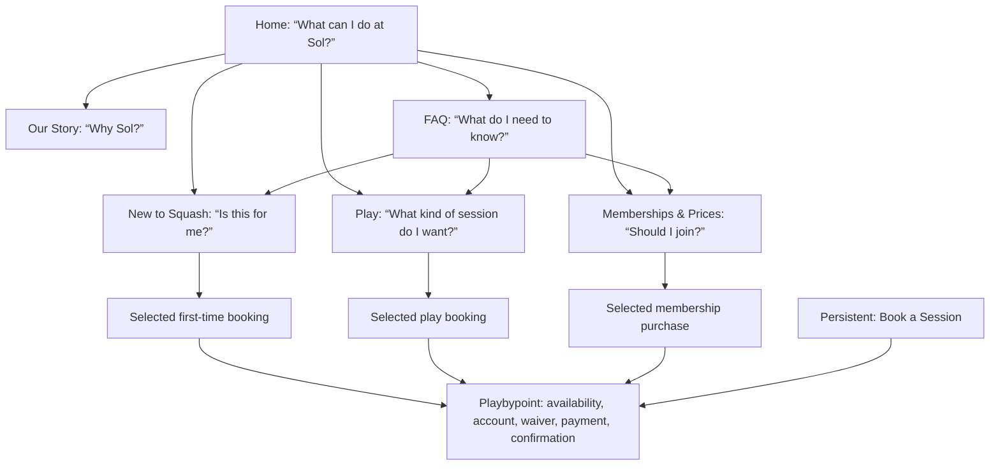

# Sol Squash Website-First UX Correction

**Status:** Recommendation for approval; no website change is made by this document.  
**Correction to the previous blueprint:** The Sol website is the **authoritative, complete, public-facing experience** for Sol Squash. It is where visitors learn, evaluate, compare, feel the brand, understand every offering, see the club’s rules and practical information, and decide what to do. **Playbypoint is not Sol’s public information source.** It is the transaction platform reached only after the visitor has made a decision on Sol’s website.

> **The intended relationship is simple:** Sol’s website answers *“Why Sol, which option is right for me, what does it cost, and what should I do next?”* Playbypoint answers only *“Which available slot do you want, and how do you complete this selected purchase or booking?”*

## Corrected Operating Model

| Responsibility | Sol website: definitive public source | Playbypoint: final fulfilment step |
|---|---|---|
| **Brand and positioning** | Owns the full Sol story, club ethos, founding team, facilities, recovery, social life, and community feeling. | No primary role. |
| **Programme knowledge** | Owns the explanation of every way to play, who it is for, what it includes, what to bring, skills required, coach context, and why it may be the right choice. | Receives the selected booking. |
| **Membership decision** | Owns benefit comparison, annual/monthly value, guest rules, booking access, family discounts, membership terms, junior context, prices, and FAQs. | Completes the chosen membership transaction. |
| **Pricing and policies** | Publishes Sol’s official visible prices, packages, cancellation explanation, booking-window explanation, and support contacts. The public site is where visitors understand the terms before committing. | Applies the configured price, slot, waiver, and payment when a purchase is completed. |
| **Conversion** | Guides visitors from confidence to one specific decision. A page must state the outcome before its CTA. | Supplies real inventory, account/sign-in, waiver, payment, confirmation, and later booking management. |
| **Support** | Provides WhatsApp, text, email, practical FAQs, and a fallback path for people who remain unsure. | Handles booking records after a transaction. |

Playbypoint’s documented booking path includes selection, potential waiver, player details, checkout, and confirmation; its configuration controls the rules that are applied during that transaction.[1] [2] These operational facts do **not** reduce the Sol website’s ownership of public truth, education, or persuasion. They simply explain why the final purchase should occur in the configured booking platform rather than an imitation checkout.

## Revised Design Principle: The Website Must Complete the Decision

The site should never use Playbypoint as an excuse to defer information. A visitor should leave a Sol page knowing the answer to the question that brought them there. The handoff occurs only when they are ready to act.

| Visitor arrives asking… | Sol website must answer before the handoff | Final CTA to Playbypoint |
|---|---|---|
| “I have never played. Is this for me?” | Yes. Explain First Lesson and Beginner Clinic, cost, duration, coaching, racket provision, no-experience reassurance, clothing/shoe advice, and what happens after arrival. | **Book Your First Lesson** or **Choose a Beginner Clinic** |
| “I want to play this week.” | Explain court booking, open play, coached sessions, private lessons, level/partner expectations, price, duration, and the difference between each. | **Book a Court**, **Choose Open Play**, **Find a Coached Session**, or **Book a Private Lesson** |
| “Should I become a member?” | Explain Sol Club, Sol Junior, monthly/annual prices, inclusions, booking advantage, guest policy, recovery access, family discount, cancellation terms, and all prices. | **Join Sol Club**, **Join Sol Junior**, or **View Membership Checkout** |
| “I am already convinced; I just want to book.” | Provide an obvious persistent escape route that clearly signals the booking transaction is next. | **Book a Session** |
| “I am confused about a practical detail.” | Supply every approved FAQ answer, written policies, location, hours, parking, contact details, and a clear contact route. | **Book a Session** only when that is the appropriate resolution |

This model follows the relevant usability principle of **progressive disclosure**: show visitors the small number of meaningful choices first, then disclose specialised policy or comparison detail when requested.[3] The information must remain on Sol’s website; it should simply be arranged so that no visitor is forced to read it all in order to take one common action.

## Corrected Site Map

The map below retains the current six destination types but makes every route a complete decision environment rather than a path into a generic booking directory.

| Navigation destination | Website role | What must be visible before any booking handoff | What should be progressively disclosed |
|---|---|---|---|
| **Home** | Orientation and immediate self-selection. | A person can identify whether they are a returning player, a first-timer, or assessing membership in the first scroll. | Deeper club, recovery, story, and founder material. |
| **Play** | Full editorial guide to playing at Sol. | The four ways to play, their fit, price, duration, and a specific action for each. | Deeper format description, coach details, player/partner notes, and session packs. |
| **New to Squash** | Full first-rally confidence path. | First Lesson and Beginner Clinic comparison, no-experience message, equipment, and clear next step. | Detailed FAQs and additional club reassurance. |
| **Memberships & Prices** | Complete membership decision page. | Sol Club, Sol Junior, membership value, price, package context, and a direct selected membership action. | Full all-prices table, terms, booking windows, family discount, and cancellation detail. |
| **Our Story** | Complete credibility and emotional context. | Founder story, genuine credentials, club purpose, and community values. | Full bios in the existing drawer; extended story detail. |
| **FAQ** | Definitive self-service support. | Topic choice and question list. | One answer at a time, followed by a specific useful next step. |
| **Book a Session** | A deliberate shortcut for decided visitors. | A concise note that the visitor is continuing to the selected booking transaction. | Nothing on the website should interrupt this committed path. |

## Page Architecture to Build

### Home: a self-selection page, not a brochure sequence

Home should open with the existing Sol atmosphere and hero copy. The first actionable panel must then answer **“What brings you here?”** with three complete paths: **Play at Sol**, **New to Squash**, and **Memberships & Prices**. These are not three promotional widgets; they are navigation decisions. Each should be visibly distinct, speak in the visitor’s language, and route to a complete answer on the website.

After that early choice, the existing club cards, recovery information, founder invitation, and mural endcap become valuable brand proof. The cards must not include arrows unless the entire card is a real link to a meaningful website destination. The user correctly identified that a decorative arrow on a static card breaks the contract between the interface and the visitor.

### Play: evaluate the activity here, not after leaving Sol

The current four ways to play should become four **decision cards**, each with the existing copy and a stable structure:

| Card | Visible decision facts | Primary website action | Final action |
|---|---|---|---|
| **Book a Court** | Your court, your hour; court price; players/partner context. | Reveal the existing long description and practical booking facts. | **Book a Court** |
| **Open Play** | Social mixer; three-hour format; price; people are matched by level. | Reveal the existing long description and helpful “no partner” guidance. | **Find an Open Play** |
| **Coached Sessions** | Small group with Bruna or Vini; formats; price. | Reveal drills, clinics, and Women Play explanation. | **See Coached Sessions** |
| **Private Lessons** | One-on-one; duration; price; coach context. | Reveal what the session is for and how to request a game instead of instruction. | **Book a Private Lesson** |

Only after these choices should the existing Taste of Sol offer appear. It then functions as a compelling alternative for someone who understands the club’s offerings, rather than as an unexplained price card. The membership prompt can close the page as a properly contextual “playing often?” decision.

### New to Squash: retain the confidence but make the choice explicit

This should remain a dedicated full page and is already the clearest current route. Preserve the approved hero copy, First Lesson, Beginner Clinic, equipment reassurance, and mural imagery. Make the decision difference explicit at a glance:

| Option | Choose it when… | Existing approved evidence to keep | Booking outcome |
|---|---|---|---|
| **First Lesson with the Pros** | You want individual attention for your first 30 minutes. | $39, one-on-one, racket provided, founders/coaches, recovery access, one per person. | Selected first-lesson booking. |
| **Beginner Squash Clinic** | You want an hour in a small beginner group. | $55, no experience needed, coached, rackets provided, dynamic and fun. | Selected beginner-clinic booking. |

The current FAQ material remains available through one clear secondary control such as **Questions before your first session?**, which opens the existing Never Played topic. This avoids repeating every answer while keeping each approved word accessible on the Sol site.

### Memberships & Prices: website-owned decision support

This page should not begin as a guest price table. Begin with the **Sol Club** value proposition and its actual decision facts, then show Sol Junior, then packages. The complete all-prices comparison must remain available, but it belongs after the initial answer, behind an explicit **Compare every price** disclosure.

| Order | Section | Job |
|---|---|---|
| 1 | **Sol Club** | Explain price, daily court access, sauna/cold plunge, member pricing, booking access, guest pass, ladders/leagues, rental, and annual option. |
| 2 | **Sol Junior** | Explain age range, seven sessions, extras, and drop-in context for parents. |
| 3 | **Do you play occasionally?** | Present the existing guest/drop-in comparison and the 5-pack offer. |
| 4 | **Compare every price** | Reveal the complete current price table in one controlled step. |
| 5 | **Membership questions** | Link directly to the existing Joining Sol FAQ topic with terms, family discount, cancellation, and booking-window detail. |

The **Join** action is the final handoff. Sol’s site has already done the explanatory and persuasive work; the visitor should not arrive at Playbypoint to discover basic membership facts.

### Upcoming Sessions: an editorial Sol page, not a pseudo-live booking app

The website should still own the “what is happening at Sol?” experience. The current mobile-first vertical session list is a good starting format because it matches the club’s warmth and does not imitate a calendar grid. The change is editorial and operational:

* If staff maintain the list, present it as **This Week at Sol** with a real visible update date and one clear activity-level booking CTA per entry.
* If Sol cannot reliably maintain it, do **not** pretend it is live. Replace the static list with a hand-curated “What you can join this week” narrative using only genuinely current information, while the persistent Book action remains available to the decided visitor.
* A Playbypoint public programme calendar may be configured by the facility, but that does not change the Sol website’s primary role.[2] Its use should be a final link, not a substitute for editorial navigation.

The current static data is dated 18 August 2026 while the task date is 27 August 2026. That mismatch is exactly the kind of trust issue a website-first model avoids: Sol controls the editorial information it chooses to publish and must label it honestly.

### FAQ: the definitive answer library

FAQ should remain a dedicated support destination with all six current categories and all approved answers. It should also become the place where the visitor gets the full practical answer, rather than being sent elsewhere for basic understanding.

Retain the category sequence and current one-question-at-a-time accordions. Add an explicit contextual resolution to each topic panel:

| Topic | Resolution inside Sol’s website | Final transaction path only if relevant |
|---|---|---|
| **The Basics** | Our Story, location details, and contact path. | Book a Session when the visitor is ready. |
| **How It Works** | Play activity guide and price comparison. | Selected play booking. |
| **Never Played** | New to Squash decision page. | Selected beginner booking. |
| **Joining Sol** | Memberships & Prices decision page. | Selected membership transaction. |
| **For the Kids** | Sol Junior explanation and parent-ready context. | Selected junior programme booking. |
| **Booking** | Clear practical explanation of timing and policy, with contact fallback. | Generic Book a Session only after the visitor decides. |

The existing raw URLs in approved FAQ text can be rendered as clickable links while keeping their visible wording unchanged. This is a usability improvement, not a copy alteration.

## Corrected Booking and Payment Design

The correct split is **website-owned conversion; platform-owned transaction.** It is not “send visitors to Playbypoint for knowledge.” The website is the place where price, value, terms, expectations, and confidence live. The external platform is only the end of a visitor’s selected path.

| Moment | Required website behavior | Why it matters |
|---|---|---|
| **Before commitment** | Show the exact offer, who it is for, price basis, duration, practical requirements, and key policy facts. | The visitor makes an informed decision before leaving the Sol experience. |
| **CTA** | Label the selected outcome precisely: Book a Court, Book Your First Lesson, Join Sol Club, or Continue to Booking. | Strong labels have better information scent and reduce choice uncertainty.[4] |
| **External transition** | Use a brief visible note only where necessary: “You’ll choose a live time and complete booking next.” | It sets an honest expectation without making Playbypoint the centre of the experience. |
| **Transaction** | Do not duplicate availability grids, account forms, waiver, payment field, or confirmation UI. | These must remain operationally consistent with the configured reservation system.[1] [2] |
| **After a booking question** | Return people to Sol’s FAQ and direct support routes for understanding; use Playbypoint only for booking-management actions. | Sol remains the visitor’s coherent brand and knowledge home. |

## Non-Negotiable Interaction Corrections

The next implementation should resolve the following before any ornamental refinement:

| Priority | Correction | Standard |
|---|---|---|
| **P0** | Remove false arrows from non-clickable cards. | Every arrow or interactive visual cue must be a real link, reveal a named local detail, or disappear. |
| **P0** | Remove faux booking behavior. | A booking-labelled action must lead to the selected booking decision; a package explanation may open information but must not call itself booking. |
| **P0** | Correct stale schedule presentation. | Do not call static data “live”; show a maintained update date or use an honest editorial framing. |
| **P1** | Make each Play card a complete choice with a selected CTA. | Never force a visitor to select a generic schedule after they have already selected an activity. |
| **P1** | Make Memberships lead with member value rather than a guest price toggle. | Explain the answer before offering the final membership transaction. |
| **P1** | Give Home a three-path decision moment directly below the hero. | Returning player, first-timer, membership consideration. |
| **P2** | Improve FAQ onward paths and turn visible URLs into functional links. | Keep every approved word and make the answer useful. |
| **P2** | Preserve consistent mobile target size and singular CTA priority. | Controls must be comfortably touchable and must never compete ambiguously.[5] |

## What Sol Must Supply Before the Booking Build

The public website can and should become complete now. To make every final purchase CTA precise, Sol must supply or confirm the final transaction addresses and current content governance.

1. The exact booked destination for each decision: court, Open Play, coached sessions, private lessons, First Lesson, Beginner Clinic, Taste of Sol, Sol Club, and Sol Junior.
2. Which staff member owns updates to current upcoming sessions, and the update frequency. If no reliable owner exists, the site must not claim live availability.
3. Whether existing prices include or exclude taxes/fees in the phrasing Sol wants to publish. The public website should be the source of that explanation even when the final total is computed at checkout.
4. The preferred final booking-policy language and a confirmation that the approved FAQ remains definitive until policy changes are supplied.

## Approval Gate

Before rebuilding the website, approve these three statements:

1. **The Sol website is the complete public source of truth.** It owns explanation, comparison, confidence, persuasion, policy description, and club identity.
2. **Playbypoint is reached only after a selected decision.** It owns the live operational transaction, not the public product explanation.
3. **Every piece of approved copy remains in the website.** Long information becomes easy through visible choices, expandable details, focused drawers, well-labeled comparison panels, and task-specific FAQ routes—not by deletion.

## References

[1] [Playbypoint Help Center, “How Players Book a Court”](https://help.playbypoint.com/en/articles/10859758-how-players-book-a-court).

[2] [Playbypoint Help Center, “All Reservation Rules Explained”](https://help.playbypoint.com/en/articles/11395832-all-reservation-rules-explained).

[3] [Nielsen Norman Group, “Progressive Disclosure”](https://www.nngroup.com/articles/progressive-disclosure/).

[4] [Nielsen Norman Group, “Navigation”](https://www.nngroup.com/topic/navigation/).

[5] [W3C WAI, “Understanding Success Criterion 2.5.8: Target Size (Minimum)”](https://www.w3.org/WAI/WCAG22/Understanding/target-size-minimum.html).
